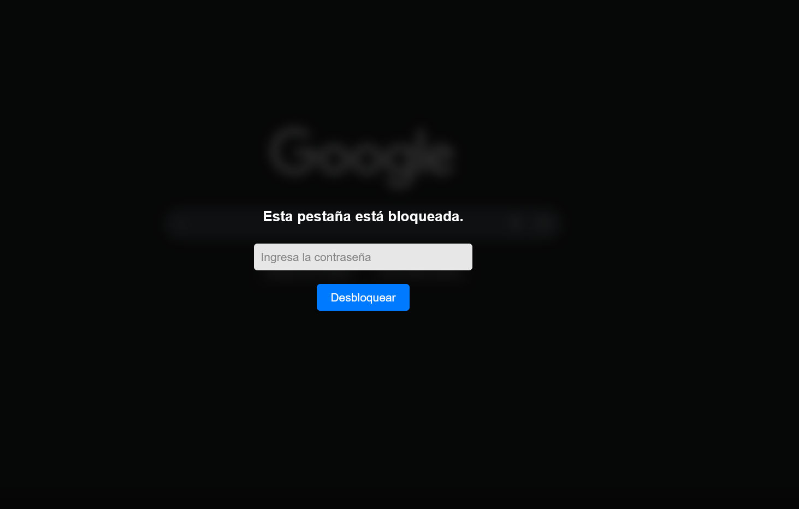
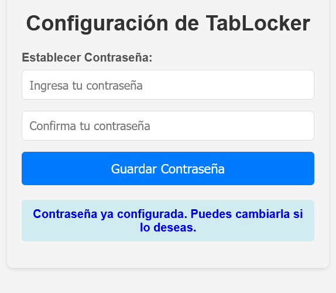
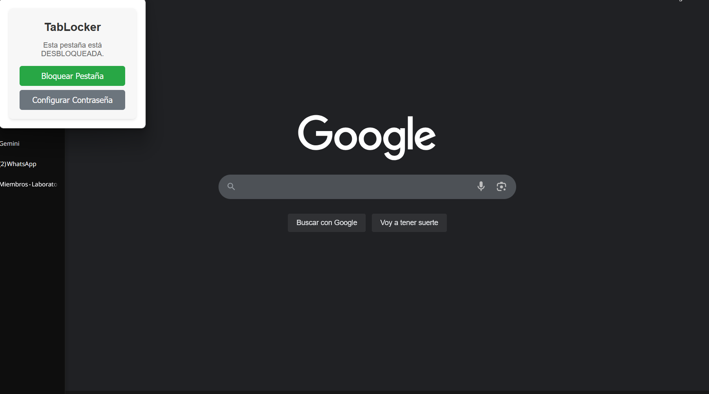

# 🔒 TabLocker: Extensión de Firefox para Bloquear Pestañas

**TabLocker** es una extensión para Firefox diseñada para ofrecerte una capa adicional de privacidad y control sobre tus pestañas, permitiéndote bloquearlas con una contraseña y disuadir el acceso no autorizado o la simple curiosidad.

✨ ¡Mantén tus pestañas sensibles seguras y evita distracciones con un simple clic!

---

## 🎯 Te ha sucedido esto ...

En muchas situaciones, podemos necesitar alejarnos de nuestro navegador dejando pestañas abiertas con información sensible, o simplemente queremos evitar que otras personas (o nosotros mismos, para evitar procrastinar) accedan al contenido de una pestaña específica. TabLocker aborda estos escenarios al permitirte:

* **Proteger la privacidad:** Evita que miradas indiscretas vean el contenido de una pestaña cuando compartes tu pantalla o te alejas brevemente.
* **Reducir distracciones:** Bloquea pestañas que podrían ser una fuente de distracción mientras trabajas o estudias.
* **Control de acceso temporal:** Asegura temporalmente una pestaña sin necesidad de cerrar sesión en sitios web o cerrar la pestaña por completo.

---

## 🚀 Características Principales

* **Bloqueo por Contraseña:** Protege tus pestañas con una contraseña personalizable.
* **Ofuscación Visual:** Una vez bloqueada, el contenido de la pestaña se cubre con una superposición (overlay) que lo difumina y muestra un campo para ingresar la contraseña.
* **Seguridad de Contraseña Mejorada:**
    * La contraseña se almacena de forma segura utilizando **hashing SHA-256** (a través de la Web Crypto API). No se guarda en texto plano.
* **Persistencia del Bloqueo:**
    * El overlay intenta **restaurarse automáticamente** si se detecta su eliminación manual a través de herramientas de desarrollo (utilizando un `MutationObserver`), dificultando la evasión simple.
* **Fácil de Usar:**
    * Un **icono en la barra de herramientas** permite bloquear o desbloquear la pestaña activa con un solo clic (el desbloqueo desde el icono es posible si la pestaña ya estaba bloqueada y se desea quitar el estado de bloqueo general, pero el overlay pedirá contraseña).
    * Página de **opciones intuitiva** para configurar y cambiar tu contraseña.
* **Ligera y Rápida:** Diseñada para no interferir con tu experiencia de navegación.

---

## 🛠️ ¿Cómo Funciona? (Detalles Técnicos)

TabLocker combina varias APIs de WebExtensions y técnicas del lado del cliente para lograr su funcionalidad:

1.  **Configuración de Contraseña:**
    * Desde la página de opciones de la extensión, estableces una contraseña.
    * Esta contraseña es procesada por la función `sha256(tuContraseña)` utilizando `crypto.subtle.digest` para generar un hash SHA-256.
    * El **hash resultante** (no la contraseña original) se guarda en `browser.storage.local` bajo la clave `storedPasswordHash`.

2.  **Bloqueo de Pestaña:**
    * Al hacer clic en el icono de la extensión en una pestaña activa (o mediante un futuro atajo de teclado), se envía un mensaje al script de fondo (`background.js`).
    * El `background.js` registra el ID de la pestaña como bloqueada e inyecta el script de contenido (`scripts/content.js`) en esa pestaña.
    * `content.js` crea dinámicamente un `div` (overlay) que cubre toda la ventana de la pestaña. Este overlay contiene un campo para la contraseña y un botón de desbloqueo.
    * Se inicia un `MutationObserver` para vigilar la integridad del overlay.

3.  **Desbloqueo de Pestaña:**
    * Ingresas la contraseña en el campo del overlay.
    * La contraseña ingresada es enviada desde `content.js` al `background.js`.
    * El `background.js` toma la contraseña ingresada, la hashea usando el mismo proceso SHA-256.
    * Compara el hash recién generado con el `storedPasswordHash` recuperado de `browser.storage.local`.
    * Si los hashes coinciden, el `background.js` envía un mensaje a `content.js` para eliminar el overlay y marca la pestaña como desbloqueada.

4.  **Persistencia del Overlay:**
    * Si el `MutationObserver` en `content.js` detecta que el nodo del overlay es eliminado del DOM (por ejemplo, por un usuario a través del inspector de elementos), intentará recrear el overlay inmediatamente. Esto hace que sea más tedioso eludir el bloqueo de forma manual.

5.  **Gestión de Estado:**
    * El `background.js` mantiene un objeto con los IDs de las pestañas que están actualmente bloqueadas, persistiendo este estado en `browser.storage.local` para que los bloqueos puedan sobrevivir a reinicios del navegador (si la pestaña sigue abierta).
    * Los listeners en `tabs.onUpdated` y `tabs.onRemoved` ayudan a mantener actualizado este estado y a reaplicar el bloqueo si una pestaña bloqueada se actualiza.

---

## 🖼️ Capturas de Pantalla

* *Ejemplo: El overlay de bloqueo en acción.*

* *Ejemplo: La página de opciones para configurar la contraseña.*

* *Ejemplo: El icono de la extensión en la barra de herramientas.*

---
## EXTENSION EN FIREFOX OFICIAL

Afortunadamente paso la aprobacion de los revisores de firefox y actualmente la extension la puedes encontrar en el mercado de mozilla de extensiones,
aqui te dejo el link de la extension, para que la descargues. Te agradeceria mucho que dejes tus opiniones o recomendaciones de la extension.

https://addons.mozilla.org/es-ES/firefox/addon/blurtab/

--
## ⚙️ Instalación Local (Para Desarrollo o Pruebas en Firefox)

Puedes cargar y probar TabLocker localmente en Firefox siguiendo estos pasos:

1.  **Clona o Descarga el Repositorio:**
    * Si tienes Git: `git clone https://github.com/tu-usuario/TabLocker.git` (reemplaza con tu URL)
    * O descarga el archivo ZIP desde GitHub y extráelo en una carpeta.

2.  **Abre Firefox.**

3.  **Accede a la Página de Depuración de Complementos:**
    * Escribe `about:debugging` en la barra de direcciones y presiona Enter.
    * Haz clic en "Este Firefox" (o "This Firefox") en el panel lateral izquierdo.

4.  **Carga el Complemento Temporalmente:**
    * Haz clic en el botón "Cargar complemento temporal..." (o "Load Temporary Add-on...").
    * Navega hasta la carpeta donde clonaste o extrajiste los archivos de la extensión.
    * Selecciona el archivo `manifest.json` dentro de esa carpeta y haz clic en "Abrir".

5.  **¡Extensión Cargada!**
    * El icono de TabLocker debería aparecer en tu barra de herramientas.
    * **Importante:** El complemento cargado de esta manera es temporal y se eliminará cuando cierres Firefox (a menos que uses Firefox Developer Edition y habilites la persistencia para complementos temporales en las opciones de desarrollo).

6.  **Configura tu Contraseña:**
    * Haz clic derecho sobre el icono de TabLocker en la barra de herramientas.
    * Selecciona "Administrar extensión".
    * Ve a la pestaña "Preferencias" u "Opciones" de la extensión.
    * Establece y guarda tu contraseña.

---

## 🖱️ Uso de la Extensión

1.  **Instalación:** Sigue los pasos de "Instalación Local" o instálala desde la tienda de complementos de Firefox (si se publica).
2.  **Configuración Inicial:** Abre las opciones de la extensión para establecer tu contraseña maestra.
3.  **Bloquear una Pestaña:**
    * Navega a la pestaña que deseas bloquear.
    * Haz clic en el icono de TabLocker 🔒 en la barra de herramientas. La pestaña se ofuscará y mostrará el diálogo de contraseña.
4.  **Desbloquear una Pestaña:**
    * Ingresa la contraseña que estableciste en el campo provisto en el overlay.
    * Presiona "Desbloquear" o la tecla Enter.
5.  **Cambiar Contraseña:**
    * Accede a la página de opciones de la extensión (generalmente haciendo clic derecho en el icono de la extensión > "Administrar extensión" > "Opciones", o desde la página `about:addons`).

---

## 💻 Tecnologías Utilizadas

* **JavaScript (ES6+):** Lógica principal de la extensión, incluyendo `async/await` para operaciones asíncronas.
* **WebExtensions API:** API estándar para el desarrollo de extensiones de navegador (específica para Firefox en esta implementación).
    * `browser.storage.local`
    * `browser.runtime`
    * `browser.tabs`
    * `browser.scripting`
    * `browser.action`
* **HTML5 y CSS3:** Para la estructura y estilo del popup y la página de opciones, así como el overlay dinámico.
* **Web Crypto API (`crypto.subtle`):** Utilizada para el hashing SHA-256 seguro de la contraseña.
* **`MutationObserver` API:** Para detectar y reaccionar a cambios en el DOM (específicamente, la eliminación del overlay).

---

## 💡 Posibles Mejoras Futuras y Contribuciones

¡Las contribuciones son bienvenidas! Aquí hay algunas ideas para futuras mejoras:

* [ ] **Soporte Multi-navegador:** Adaptar la extensión para Chrome y otros navegadores basados en Chromium.
* [ ] **Bloqueo Automático:** Opción para bloquear pestañas automáticamente después de un período de inactividad.
* [ ] **Listas Blancas/Negras:** Permitir al usuario especificar sitios que nunca se bloqueen o que se bloqueen automáticamente al abrirlos.
* [ ] **Hashing Más Robusto:** Implementar algoritmos de hashing con "salting" y "key stretching" (como Argon2 o PBKDF2) para una seguridad de contraseña aún mayor.
* [ ] **Opciones de Personalización del Overlay:** Permitir cambiar colores, opacidad o mensajes.
* [ ] **Internacionalización (i18n):** Soporte para múltiples idiomas.
* [ ] **Atajos de Teclado:** Para bloquear/desbloquear pestañas rápidamente.

Si deseas contribuir, por favor haz un fork del repositorio y envía un Pull Request con tus cambios.

---

## 📄 Licencia

Este proyecto está licenciado bajo la Licencia MIT. Ver el archivo `LICENSE` para más detalles. 
